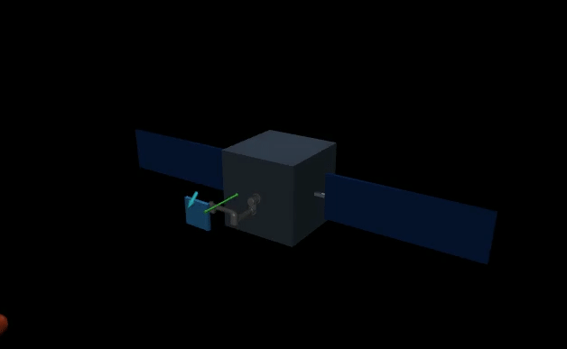
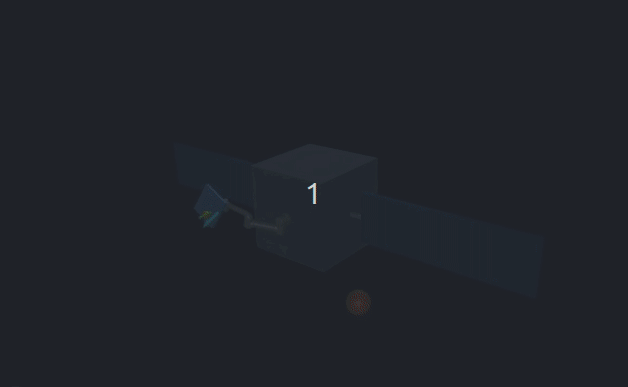
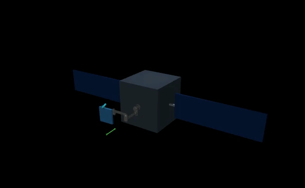
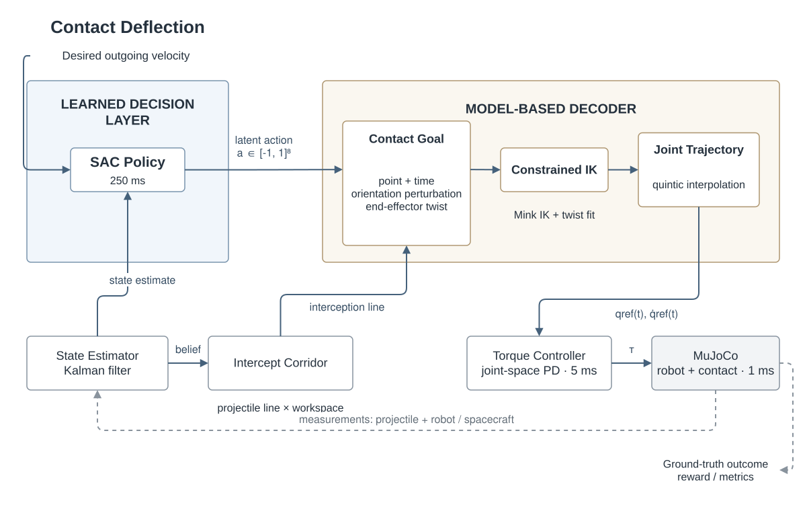

# Contact Deflection

Contact Deflection is a MuJoCo benchmark for **goal-conditioned projectile redirection with a free-floating spacecraft manipulator**. A six-joint UR5 carries a shield and must intercept an incoming projectile from noisy position measurements while arm motion reacts on the uncontrolled spacecraft base.

The central research question is:

> Can a low-frequency learned policy choose **where, when, and how** to contact a projectile while a model-based stack realizes those decisions at control rate—and can the resulting contact achieve a desired outgoing velocity without excessive spacecraft disturbance?

The current approach uses **Soft Actor-Critic (SAC)** to choose a structured end-effector contact intent, while estimation, inverse kinematics, trajectory generation, and torque control remain model-based. This separates **learning contact strategy** from **learning joint-level robot motion**.

## Example rollouts

<p align="center">
  
  
  
</p>

<p align="center">
  <em>Example contact trajectories after a short SAC training run. These rollouts are qualitative demonstrations rather than converged-policy results.</em>
</p>

## System overview

The learned policy operates at **4 Hz** and chooses a structured 8D contact action. A model-based stack maps this action to a reachable end-effector contact goal, solves terminal IK and twist matching, generates a joint trajectory, and tracks it at **200 Hz** while MuJoCo integrates free-floating contact dynamics at **1 kHz**.

<p align="center">
  
</p>

The main responsibilities are:

| Component            | Responsibility                                                                            |
| -------------------- | ----------------------------------------------------------------------------------------- |
| Environment          | Sample randomized tasks, simulate free-floating dynamics and contact, and compute rewards |
| Estimator            | Maintain a Gaussian belief over projectile position and velocity                          |
| SAC policy           | Choose an 8D end-effector-centric contact intent every 250 ms                             |
| Decoder              | Map the latent action to contact time, pose, and terminal shield twist                    |
| Mink IK              | Find a collision-aware reachable terminal configuration                                   |
| Trajectory generator | Connect the current state to the requested terminal joint state                           |
| Controller           | Track joint references with bounded torque                                                |
| MuJoCo               | Integrate multibody and contact dynamics at 1 ms                                          |

## Current status

The repository currently includes:

* executable MuJoCo/Gymnasium environment
* randomized free-floating spacecraft/contact dynamics
* Gaussian projectile state estimator
* structured 8D contact-action decoder
* collision-aware terminal IK using Mink
* bounded terminal-twist fitting
* quintic joint-space references
* torque control
* Stable-Baselines3 SAC training and evaluation
* deterministic evaluation and video rendering
* automated scientific checks

This is **research code**, not a flight-dynamics or hardware-fidelity simulator. Important approximations are documented under [Known limitations](#known-limitations).

---

## Quick start

Create the Conda environment:

```bash
conda env create -f environment.yml
conda activate contact-deflection
```

For an existing environment:

```bash
conda env update -f environment.yml --prune
conda activate contact-deflection
```

Alternatively:

```bash
python -m pip install -e '.[dev,render,rl]'
```

Run the deterministic checks:

```bash
pytest
ruff check src tests scripts experiments
mypy src
```

### Visualize the reachable workspace

Save a workspace visualization:

```bash
python scripts/visualize_reachable_workspace.py \
  --config configs/decoder.yaml \
  --visualization videos/reachable_workspace.png
```

Or inspect it interactively:

```bash
python scripts/visualize_reachable_workspace.py \
  --config configs/decoder.yaml \
  --live
```

## Training SAC

Run a short integration test before launching a full experiment:

```bash
python experiments/train_sac.py \
  --timesteps 10000 \
  --seed 0 \
  --run-dir outputs/sac/smoke
```

Example full training run:

```bash
python experiments/train_sac.py \
  --timesteps 1000000 \
  --seed 0 \
  --ent-coef auto_0.3 \
  --eval-episodes 20 \
  --render-episodes 3 \
  --post-contact-seconds 4 \
  --run-dir outputs/sac/full_run
```

Training saves periodic evaluation data, the best periodic checkpoint, the final checkpoint, deterministic held-out evaluation, and rendered episodes:

```text
outputs/sac/full_run/
├── final_model.zip
├── evaluation_summary.json
├── best/
│   └── best_model.zip
├── evaluations/
│   └── evaluations.npz
└── renders/
    ├── episode_00_seed_10000.mp4
    └── ...
```

Evaluate an existing run without training:

```bash
python experiments/train_sac.py \
  --eval-only \
  --run-dir outputs/sac/full_run \
  --eval-episodes 20 \
  --render-episodes 3
```

Or select a checkpoint explicitly:

```bash
python experiments/train_sac.py \
  --eval-only \
  --run-dir outputs/sac/full_run \
  --checkpoint outputs/sac/full_run/best/best_model.zip
```

Eval-only outputs are written separately and do not overwrite the original training report.

---

# Method

## Task formulation

Each episode samples physical and initial-state parameters

$$
\phi \sim p(\phi),
$$

including projectile and shield mass, MuJoCo contact parameters, arm configuration, spacecraft rates, and projectile initial state.

The simulator state contains spacecraft pose and twist, arm state, and projectile state:

$$
x_t =
\left(
T^W_{B,t},
V^W_{B,t},
q_t,
\dot q_t,
p^W_t,
v^W_t
\right).
$$

MuJoCo integrates nonlinear free-floating dynamics and contact at 1 kHz:

$$
x_{k+1}
=
F_{\Delta t_{\mathrm{sim}}}(x_k,u_k;\phi),
\qquad
\Delta t_{\mathrm{sim}}=1\text{ ms}.
$$

The simulator has access to ground-truth state for physics, reward computation, and evaluation. The **policy does not receive ground-truth projectile state or contact time**.

## State estimation

The projectile is observed through noisy position measurements in spacecraft coordinates:

$$
z_k =
(R^W_{B,k})^\top
\left(p^W_k-r^W_{B,k}\right)
+\epsilon_k,
\qquad
\epsilon_k\sim\mathcal N(0,\Sigma_z).
$$

A Kalman filter maintains a Gaussian belief over world-frame projectile position and velocity using a constant-velocity prior:

$$
\begin{bmatrix}
p^W_{k+1}\\
v^W_{k+1}
\end{bmatrix}
=
\begin{bmatrix}
I & \Delta t I\\
0 & I
\end{bmatrix}
\begin{bmatrix}
p^W_k\\
v^W_k
\end{bmatrix}
+Gw_k.
$$

The posterior is transformed to spacecraft-relative coordinates before being passed to the policy.

The Gymnasium observation is

$$
o_t =
\{
\texttt{observation}\in\mathbb R^{49},
\;
\texttt{desired\_goal}\in\mathbb R^3
\}.
$$

The 49D observation contains the projectile belief mean and covariance diagonal, arm state, spacecraft pose and twist, previous action, interception-corridor features, and episode progress.

The goal is the desired outgoing projectile velocity expressed in current spacecraft coordinates.

## Temporal abstraction

SAC acts every 250 ms:

$$
a_t\sim\pi_\theta(a\mid o_t,g),
\qquad
a_t\in[-1,1]^8.
$$

Each action specifies a complete contact goal and joint trajectory. Only the first 250 ms is executed before observing and replanning.

| Layer              | Period | Frequency |
| ------------------ | -----: | --------: |
| SAC / replanning   | 250 ms |      4 Hz |
| Torque control     |   5 ms |    200 Hz |
| MuJoCo integration |   1 ms |     1 kHz |

This gives SAC a short receding-horizon decision sequence while retaining fine contact simulation.

## Structured contact action

For projectile belief mean $(\hat p^W,\hat v^W)$, the decoder considers the mean projectile trajectory

$$
p^W(\tau)=\hat p^W+\tau\hat v^W.
$$

This trajectory is intersected with a spacecraft-attached ellipsoidal candidate workspace

$$
\mathcal W=
\left\{
p:
\left\|
D^{-1}R_{WB}^{\top}(p-c^W)
\right\|_2
\le 1
\right\}.
$$

If the feasible time interval is $[\tau_-,\tau_+]$, the first SAC action coordinate selects

$$
\tau(a_0)
=
\tau_-
+
\frac{a_0+1}{2}
(\tau_+-\tau_-).
$$

The 8D action has the following semantics:

| Coordinate | Meaning                                                                 |
| ---------- | ----------------------------------------------------------------------- |
| 0          | Coupled contact position/time along the estimated projectile trajectory |
| 1–2        | Shield-normal tilt about the contact tangent axes                       |
| 3–5        | Shield-center linear velocity in normal/tangent coordinates             |
| 6–7        | Angular velocity about tangent axes; currently zero-scaled by default   |

The contact frame is

$$
C=[n,t_1,t_2],
\qquad
n=-\frac{\hat v^W}{\|\hat v^W\|}.
$$

Mink IK constrains shield-center position and alignment of the shield's local $+z$ normal. Shield yaw remains free, allowing the wrist to exploit this redundancy for reachability.

IK freezes the measured spacecraft pose and enforces configured joint and collision constraints.

## Terminal twist and trajectory generation

At the terminal configuration, desired joint velocity is obtained from a bounded regularized twist fit:

$$
\dot q^*
=
\arg\min_{-\dot q_{\max}\le\dot q\le\dot q_{\max}}
\left\|
W^{1/2}
(J(q)\dot q-\xi^*)
\right\|_2^2
+
\lambda\|\dot q\|_2^2.
$$

The current trajectory backend fits independent quintics

$$
q_j(t)=\sum_{i=0}^{5}c_{j,i}t^i
$$

between the initial and requested terminal $(q,\dot q,\ddot q)$.

> **Current implementation:** this is endpoint interpolation, not constrained trajectory optimization. Position, velocity, acceleration, and jerk limits are checked for diagnostics but are not currently enforced by the trajectory solver.

Torque tracking uses bounded PD control:

$$
u=
\operatorname{clip}
\left(
K_p(q_{\mathrm{ref}}-q)
+
K_d(\dot q_{\mathrm{ref}}-\dot q),
-u_{\max},
u_{\max}
\right).
$$

## Reward

Rewards are zero before termination.

Following shield contact, the environment executes a short follow-through and braking phase, waits for separation, and measures the outgoing projectile velocity.

The successful-contact reward is

$$
r_T=
\exp\left[
-\left(
\frac{\|v_{\mathrm{out}}-v_{\mathrm{goal}}\|_2}{\sigma_v}
\right)^2
\right]
-
w_L
h_\delta
\left(
\frac{\|\Delta L_B\|_2}{L_0}
\right),
$$

where $\Delta L_B$ is the change in angular momentum of the spacecraft bus-and-arm subtree.

Misses receive

$$
r_T=
-c_{\mathrm{miss}}
-
h_\delta
\left(
\frac{d_{\min}}{d_0}
\right)
-
w_L
h_\delta
\left(
\frac{\|\Delta L_B\|_2}{L_0}
\right).
$$

Reward parameters are configured in `configs/env.yaml`.

SAC optimizes the standard maximum-entropy objective

$$
J(\pi)
=
\mathbb E
\left[
\sum_t
\gamma^t
\left(
r_t+
\alpha\mathcal H(\pi(\cdot\mid o_t,g))
\right)
\right].
$$

The current training default uses adaptive entropy tuning initialized at $\alpha_0=0.3$ (`auto_0.3`). Short preliminary experiments favored adaptive entropy over fixed $\alpha=0.01$; this is an empirical default rather than a completed hyperparameter study.

## Benchmark distribution

Each reset samples Gaussian dynamics and initial-state parameters from `configs/env.yaml`.

Projectile trajectories use broad transverse variation around the candidate workspace. Outliers are rejection-sampled unless the true future trajectory crosses a 95%-scale inner workspace. This maintains a meaningful interception task without projecting samples onto the workspace boundary.

The desired outgoing velocity is sampled in the incoming contact frame with a positive normal component and Gaussian tangent components.

Episode parameters are available through:

```python
info["episode_parameters"]
```

---

## Configuration

* `configs/env.yaml` — clocks, sensing, torque control, rewards, goal distribution, and randomized episode parameters
* `configs/decoder.yaml` — candidate workspace, IK, action scales, joint velocity limits, and trajectory derivative limits
* `environment.yml` — reproducible Conda environment

Current velocity, acceleration, jerk, and torque limits are intentionally aggressive simulation settings and should **not** be interpreted as verified UR5 hardware limits.

## Repository structure

```text
assets/mjcf/                         MuJoCo spacecraft/contact model
configs/                             Environment and decoder parameters
experiments/train_sac.py             Training/evaluation orchestration
scripts/visualize_reachable_workspace.py

src/contact_deflection/
├── envs/                            Gymnasium environment + simulator
├── estimation/                      Projectile belief + interception corridor
├── geometry/                        Contact-frame construction
├── kinematics/                      Workspace + collision-aware Mink IK
├── control/                         Decoder, twist fit, trajectory, controller
├── rl/                              SAC training + evaluation
└── visualization/                   Offscreen + interactive visualization

tests/                               Deterministic scientific checks
third_party/                         Pinned upstream assets + licenses
scratch/                             Ignored one-off investigations
```

## Development

Please preserve the separation between **environment, estimation, contact decoding, kinematics, trajectory generation, control, and learning** when extending the repository.

Use `scratch/` for one-off debugging and investigations rather than adding temporary scripts to the tracked source tree.

Before committing:

```bash
pytest
ruff check src tests scripts experiments
mypy src
```

Changes that alter the benchmark definition, observation/action semantics, reward, randomization distribution, or model-based decoder should be reflected in the relevant configuration and documentation.

## Known limitations

* Projectile motion is linear in the inertial frame before contact; CW orbital acceleration is intentionally out of scope.
* Spacecraft pose and twist are treated as known by the estimator.
* IK and terminal Jacobians freeze the current spacecraft pose rather than predicting generalized-Jacobian momentum coupling.
* MuJoCo still executes the resulting arm/base reaction dynamics.
* Collision constraints apply to terminal IK, not the full joint-space trajectory.
* The quintic backend is endpoint interpolation rather than collision-aware or dynamically constrained trajectory optimization.
* Trajectory derivative violations are diagnostic and do not currently prevent execution.
* Action coordinates 6–7 are reserved for shield angular velocity but are zero-scaled by default.
* Spacecraft geometry, contact parameters, and actuator limits are simplified research models rather than flight-qualified hardware.
* Terminal-reward design and SAC hyperparameters require validation over longer runs and multiple seeds.

## Third-party assets

UR5 meshes and the adapted arm model are derived from [SpaceRobotEnv](https://github.com/Tsinghua-Space-Robot-Learning-Group/SpaceRobotEnv) at the commit pinned in `THIRD_PARTY.md`.

The upstream Apache-2.0 license is reproduced under `third_party/space_robot_env/`.
